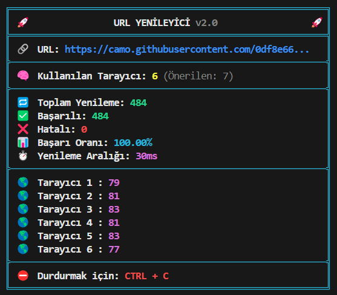

# 🚀 URL Yenileyici Projesi



## 📌 Özellikler

- ✨ Çoklu tarayıcı desteği
- ⚡ Otomatik hız optimizasyonu
- 📊 Gerçek zamanlı istatistikler
- 🏓 Anlık ping takibi
- 🔄 Özelleştirilebilir ayarlar

## 🛠️ Kurulum

1. Node.js'i yükleyin: [https://nodejs.org/](https://nodejs.org/)
2. Projeyi klonlayın:
```bash
git clone https://github.com/sizin-kullanici-adiniz/url-yenileyici.git
```
3. Bağımlılıkları yükleyin:
```bash
npm install
```

## 🎛️ Yapılandırma

`config.js` dosyasını düzenleyerek ayarları özelleştirin:

```javascript
{
  url: 'HEDEF_URL',
  refreshInterval: 50, // ms cinsinden
  browserCount: 4,    // Çalışacak tarayıcı sayısı
  headless: true,     // Arkaplanda çalışma modu
  pingHost: 'google.com' // Ping atılacak sunucu
  timeout: 10000, // 10000 yada 30000 
  ping_kontrol: false,
}
```

## 🏃‍♂️ Başlatma

```bash
node index.js
```

## 🖥️ Arayüz Önizlemesi

```
╔═══════════════════════════════════════════════════════════╗
║ 🚀                  URL YENİLEYİCİ v2.0               🚀 ║
╠═══════════════════════════════════════════════════════════╣
║ 🔗  URL: https://camo.githubusercontent.com/0df8e667d... ║
╠───────────────────────────────────────────────────────────╣
║ 🧠  Kullanılan Tarayıcı: 4 (Önerilen: 7)                 ║
╠───────────────────────────────────────────────────────────╣
║ 🔁  Toplam Yenileme: 1245                                ║
║ ✅  Başarılı: 1200                                       ║
║ ❌  Hatalı: 45                                           ║
║ 📊  Başarı Oranı: 96.39%                                 ║
║ ⏱️  Yenileme Aralığı: 35ms                               ║
║ 🏓  Ping: 28ms                                           ║
╠───────────────────────────────────────────────────────────╣
║ 🌎  Tarayıcı 1: 312                                      ║
║ 🌎  Tarayıcı 2: 310                                      ║
║ 🌎  Tarayıcı 3: 311                                      ║
║ 🌎  Tarayıcı 4: 312                                      ║
╠──────────────────────────────────────────────────────────╣
║ ⛔  Durdurmak için: CTRL + C                             ║
╚══════════════════════════════════════════════════════════╝
```

## 📊 Performans İpuçları

1. Tarayıcı sayısını CPU çekirdek sayınıza göre ayarlayın
2. Başarı oranı düşükse yenileme hızını azaltın
3. Ping süresi yüksekse daha yakın bir sunucu seçin

## 🛑 Durdurma

Programı durdurmak için `CTRL + C` tuş kombinasyonunu kullanın.

## 📜 Lisans

MIT Lisansı - Daha fazla bilgi için [LICENSE](LICENSE) dosyasına bakın.

---

<div align="center">
  <a href="https://github.com/LWEAXO">
    
  </a>
  <a href="https://discord.gg/h7YAermnyw">
    
  </a>
</div>